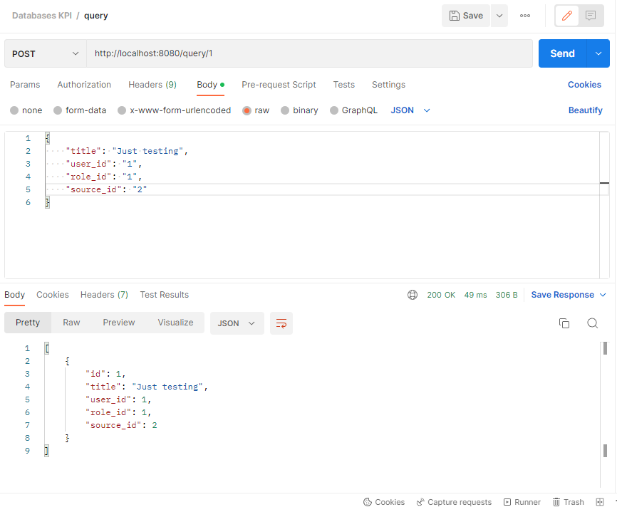
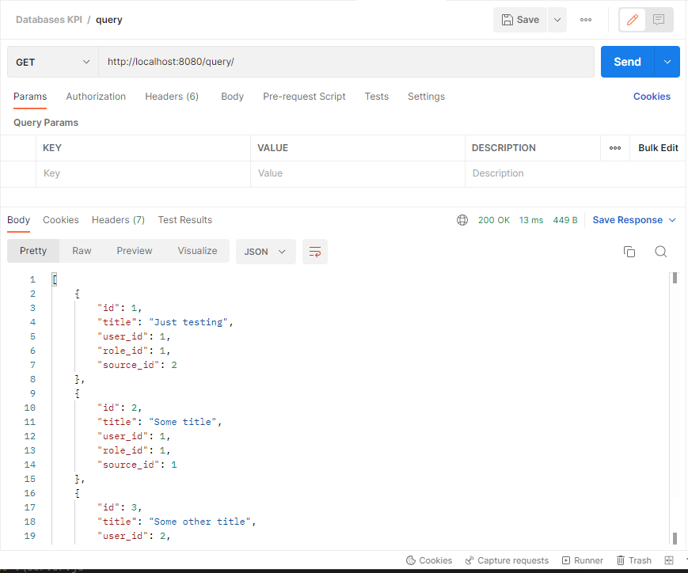
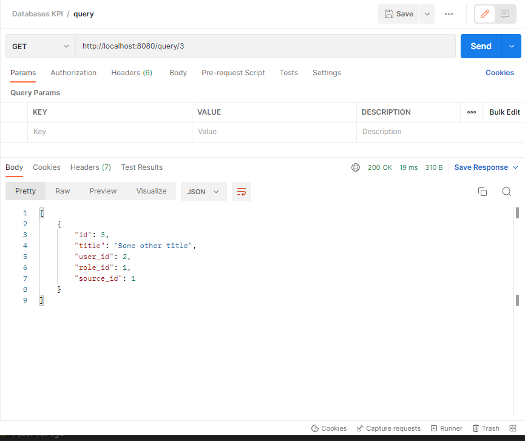
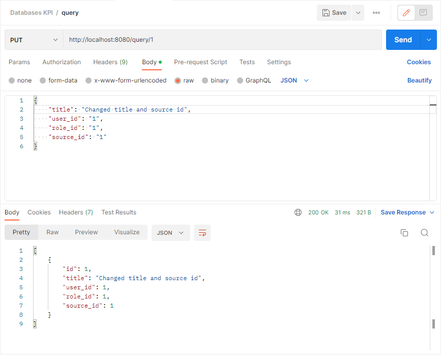
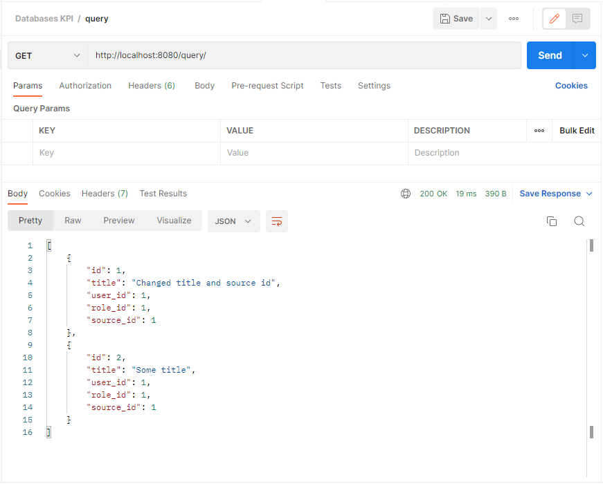

# Тестування працездатності системи

## POST-запит для додавання нового рядка

## GET-запит для перевірки всіх рядків

## GET-запит для перевірки рядку з конкретним id

## PUT-запит для зміни наявного рядка

## Контрольний GET-запит для перевірки успішності попередніх запитів

